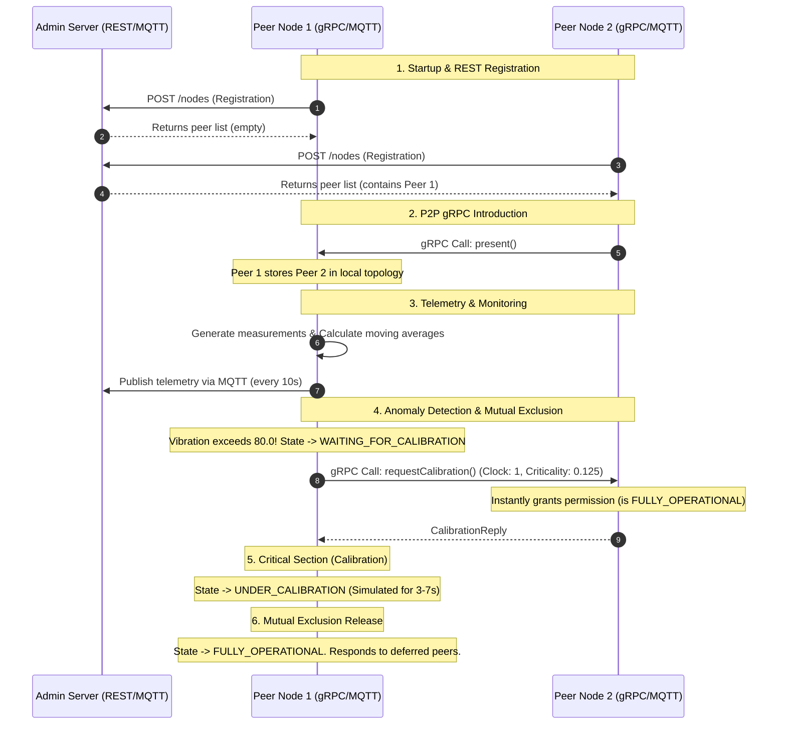

# SmartFab - Intelligent Manufacturing Simulation

SmartFab is a distributed simulation of an intelligent manufacturing plant adopting paradigms of distributed and pervasive systems. The project implements a mesh of Peer-to-Peer nodes (Production Lines) that autonomously monitor mechanical vibrations, cooperate using mutual exclusion algorithms to access calibration resources, and report their telemetry to a central server.

## 📄 Project Specs (PDF)
The complete project specification including academic requirements and architectural guidelines is available at:
* [DPS_Project_2026.pdf](resources/DPS_Project_2026.pdf) (Local link: [DPS_Project_2026.pdf](file:///home/roberto/Desktop/DistributedAndPervasiveSystems/SmartFab/SmartFab/resources/DPS_Project_2026.pdf))

---

## ⚙️ Architecture and Execution Pipeline

The system is composed of three main modules:
1. **Administration Server (Spring Boot)**: Provides a centralized registry for topology via REST APIs and collects telemetries and states via an integrated MQTT subscriber.
2. **Production Line Nodes (P2P Peers)**: Standalone processes simulating production lines. Each node acts as a gRPC client/server and an MQTT client.
3. **Administration Client CLI**: An interactive command-line client that periodically polls the Admin Server via HTTP to display the consolidated state of the factory.

### Basic Execution Pipeline



1. **Join Phase (Registration and P2P Mesh)**:
   * Each peer starts a local gRPC server on its port at bootstrap.
   * The peer contacts the Admin Server via HTTP POST to register. It receives the list of currently registered peers.
   * The peer sends parallel gRPC `present` calls to each existing peer to add itself to their local topology maps.
2. **Local Monitoring and Telemetry**:
   * The peer's sensor continuously samples vibration values.
   * A consumer thread calculates the average over a sliding window of 8 samples (with 50% overlap).
   * An MQTT publishing loop sends the accumulated averages every 10 seconds to the MQTT Broker (Mosquitto) on `smartfab/telemetry/{id}`.
3. **Mutual Exclusion Algorithm (Adapted Ricart-Agrawala)**:
   * If the calculated average exceeds the anomaly threshold (`80.0`), the node pauses its sensor and requests exclusive access to calibration (critical section).
   * It sends a gRPC `requestCalibration` request in parallel to all peers, including its Lamport clock and dynamic **Criticality** value `(average - threshold)/threshold`.
   * **Conflict Resolution on Receiving Peer**:
     * If the receiver is in state `UNDER_CALIBRATION`, it defers the response by storing the sender's gRPC observer.
     * If the receiver is in state `WAITING_FOR_CALIBRATION`, it compares priorities: the higher Criticality wins; in case of a tie, the higher node ID acts as a tie-breaker. If the receiver has higher priority, it defers the reply, otherwise it replies immediately.
     * If the receiver has lower priority but had already received an assent reply from the sender, it applies **Yielding** logic (invalidates the received reply and asynchronously re-sends its own calibration request).
   * **Release**: Upon completing calibration (random duration 3-7s), the node state returns to `FULLY_OPERATIONAL`, sends deferred replies, and resumes the sensor.

---

## 🔍 Hyper-Detailed Pipeline (Logical Flow and Methods)

Here is the technical timeline of events from script bootstrap to mutual exclusion resolution at the Java code level:

### Phase 1: Process Bootstrap
1. **Script Launch**: The user runs `./start_smartfab.sh N`.
2. **MQTT Broker**: The `smartfab-mosquitto` Docker container is started/verified on port `1883`.
3. **Admin Server**: `AdminServerApp` is compiled and launched. The server starts Tomcat on port `8080` and the `MqttSubscriberService` connects to the MQTT broker, subscribing to `smartfab/production-line/+/telemetry` and `smartfab/production-line/+/status`.
4. **Peer Startup**: For each of the `N` nodes, the Gradle task `runPeer` is executed with specific startup arguments.
   * `NodeConfig.parseArgs(args)` parses and validates the CLI parameters (ID, IP, gRPC port, Admin Server URL, MQTT Broker URL).
   * `LogUtils.redirectSystemOutAndErr` redirects standard output streams to intercept prints, prepend timestamps, apply ANSI colors matching the node ID, and write them in real-time to `smartfab.log`.

### Phase 2: Network Connection & P2P Mesh
5. **Local gRPC Server**: `NetworkManager.startGrpcServer()` creates and starts a local Netty gRPC server hosting `PeerServiceImpl`.
6. **REST Registration**: `NetworkManager.registerWithAdminServer()` makes an HTTP POST `/nodes` call with the node's network identity. It receives the JSON list of all previously registered peers.
7. **Parallel gRPC Presentation**: `NetworkManager.presentSelfToPeers()` executes an asynchronous gRPC `present(PresentationRequest)` call to each retrieved peer.
   * Each receiving peer processes the request in `PeerServiceImpl.present()`, adding the new peer to its internal topology map via `NetworkManager.addPeer(newPeer)`.
8. **MQTT Connection**: `MqttManager.connectMqtt()` establishes the connection with the Mosquitto broker and publishes the initial `OperationalState.FULLY_OPERATIONAL` update to the node's status topic.

### Phase 3: Monitoring & Telemetry
9. **Physical Sampling**: `SensorManager.startMonitoring()` starts the sensor. The `MonitoringSensor` simulates physical vibration readings via a thread-based `Simulator` class, writing them continuously to the shared `SlidingWindowBuffer`.
10. **Sliding Window Read**: The internal consumer thread of `SensorManager` executes a blocking read on `SlidingWindowBuffer.readAllAndClear()`. This method unblocks once 8 measurements are ready (with 50% overlap, 4-element step).
11. **Average Aggregation**: The thread calculates the arithmetic average of the window, stores it in the coordinator state (`RicartAgrawalaCoordinator.setLastCalculatedAverage(average)`), and appends it to the local telemetry queue via `MqttManager.addAverage(average)`.
12. **MQTT Telemetry Loop**: Every 10 seconds, the periodic thread of `MqttManager` retrieves the accumulated averages, builds a JSON payload containing the node ID, averages, state, and timestamp, and publishes it to `smartfab/telemetry/{id}`.

### Phase 4: Mutual Exclusion Coordination (Anomaly Trigger)
13. **Threshold Exceeded**: If the average calculated by `SensorManager` exceeds `80.0` and the node state is `FULLY_OPERATIONAL`, `ProductionLineNode.transitionToWaitingForCalibration(average)` is triggered.
14. **State Transition**:
    * The node transitions to `WAITING_FOR_CALIBRATION`, immediately notifying the Admin Server via MQTT.
    * The sensor is paused (`SensorManager.pauseMeasuring()`) and the window buffer is cleared (`SensorManager.clearBuffer()`).
15. **Calibration Request (RA Algorithm)**:
    * A dedicated thread is spawned to coordinate section entry: `RicartAgrawalaCoordinator.enterCalibrationAndWait()`.
    * The coordinator increments its Lamport clock, records the request timestamp, calculates its dynamic criticality `(average - threshold)/threshold`, and resets the set of received replies.
    * It broadcasts parallel gRPC blocking `requestCalibration(CalibrationRequest)` calls to all registered peers (using a 120-second timeout).
16. **gRPC Priority Valuation (Server-Side on Receiving Peer)**:
    When a peer receives a gRPC request in `PeerServiceImpl.requestCalibration()`:
    * It updates its logical clock via `RicartAgrawalaCoordinator.updateClockOnReceive()`.
    * It checks its local state:
      * **If the receiver is `UNDER_CALIBRATION`**: It defers the reply by storing the sender's gRPC observer via `RicartAgrawalaCoordinator.addDeferredObserver()`.
      * **If the receiver is `WAITING_FOR_CALIBRATION`**: It compares the local criticality with the sender's criticality.
        * If the local criticality is higher, it defers the sender.
        * If the local criticality is equal, the node with the higher ID has priority and defers the lower ID.
        * If the sender has higher priority, the receiver yields (**Yielding**): it sends an immediate assent reply. If it had already received an assent reply from that sender previously, it invalidates it (`removeReply`) and asynchronously re-requests calibration from that peer.
      * **If the receiver is `FULLY_OPERATIONAL`**: It replies immediately with a success `CalibrationReply`.
   * **Critical Section Entry**:
     * The requesting coordinator thread remains blocked in a `while (repliesReceived.size() < peers.size()) { wait(); }` loop.
     * Each received gRPC assent unblocks the thread via `notifyAll()`.
     * Once all replies are collected, the state transitions to `UNDER_CALIBRATION` (published via MQTT).
     * The node executes the simulated calibration via a random `Thread.sleep` between 3 and 7 seconds.

### Phase 5: Release & Recovery
18. **Calibration Release**: Once the sleep completes, `RicartAgrawalaCoordinator.releaseCalibration()` is executed.
19. **Deferred Reply Dispatch**:
    * The node transitions back to `FULLY_OPERATIONAL`.
    * The coordinator extracts and clears the queue of deferred observers via `getAndClearDeferredObservers()`.
    * For each observer, it sends a blank `CalibrationReply` and completes the stream (`onCompleted()`).
20. **Sensor Resume**: The physical sensor simulator is resumed (`SensorManager.startMeasuring()`), clearing the anomaly state and restarting normal sampling.

---

## 🛠️ Requirements & Dependencies

To run the project locally, you need:
* **Java Development Kit (JDK) 17** or higher.
* **Docker** installed and running (for the MQTT Broker).
* A supported terminal emulator (on Linux: `gnome-terminal`, `xfce4-terminal`, `konsole`, or `xterm`).

---

## 🚀 Quick Start Script (`.sh`)

The easiest way to start the entire simulation locally with a single command is to use the `start_smartfab.sh` script.

The script compiles the classes, starts the Mosquitto MQTT broker on Docker, launches the Admin Server, opens the peer nodes in separate terminal tabs, and starts the admin client.

Run the following command from the project root:
```bash
# Starts the simulation with N peers (e.g., 5 peers)
./start_smartfab.sh 5
```
*If the N parameter is omitted, the script starts 2 peers by default.*

---

## 💻 Manual Startup

If you prefer to start each component manually, run the following commands in separate terminals:

### 1. Start the MQTT Broker (Mosquitto)
Use Docker to run a local instance of Mosquitto without authentication on port `1883`:
```bash
docker run -d --name smartfab-mosquitto -p 1883:1883 eclipse-mosquitto mosquitto -c /mosquitto-no-auth.conf
```
*(If the container already exists, start it using `docker start smartfab-mosquitto`)*.

### 2. Start the Administration Server
Compile and launch the Spring Boot application:
```bash
./gradlew bootRun
```
The server will start listening at `http://localhost:8080`.

### 3. Start Peer Nodes (Production Lines)
Start each peer individually by passing arguments through the `-Pargs` property.
The parameter format is: `<ID> <IP> <gRPC_PORT> <SERVER_URL> <MQTT_BROKER_URL>`

For example, to start **Peer 1** on port `5001`:
```bash
./gradlew runPeer -Pargs="1 127.0.0.1 5001 http://localhost:8080 tcp://localhost:1883"
```

To start **Peer 2** on port `5002`:
```bash
./gradlew runPeer -Pargs="2 127.0.0.1 5002 http://localhost:8080 tcp://localhost:1883"
```

### 4. Start the Administration Client CLI
Launch the command-line interface to monitor the state of all production lines:
```bash
./gradlew runClient --console=plain
```
