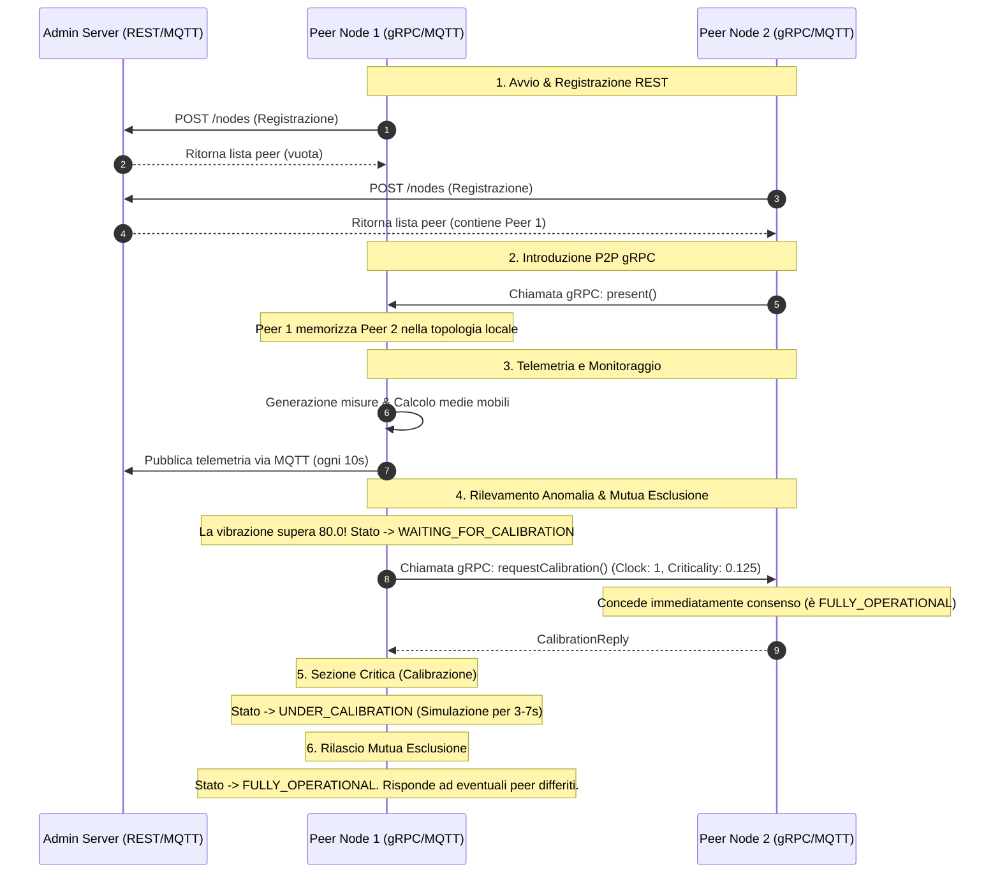

# SmartFab - Intelligent Manufacturing Simulation

SmartFab è una simulazione distribuita di un impianto manifatturiero intelligente che adotta paradigmi di sistemi distribuiti e pervasivi. Il progetto implementa una mesh di nodi Peer-to-Peer (Production Lines) che monitorano autonomamente vibrazioni meccaniche, cooperano tramite algoritmi di mutua esclusione per l'accesso a risorse di calibrazione e comunicano le proprie telemetrie a un server centrale.

## 📄 Traccia del Progetto (PDF)
La specifica completa del progetto con i requisiti accademici e le direttive architetturali è disponibile al seguente link:
* [DPS_Project_2026.pdf](resources/DPS_Project_2026.pdf) (Percorso locale: [DPS_Project_2026.pdf](file:///home/roberto/Desktop/DistributedAndPervasiveSystems/SmartFab/SmartFab/resources/DPS_Project_2026.pdf))

---

## ⚙️ Architettura e Pipeline di Funzionamento

Il sistema è composto da tre moduli principali:
1. **Administration Server (Spring Boot)**: Fornisce un registro centrale per la topologia tramite API REST e raccoglie telemetrie e stati tramite un sottoscrittore MQTT integrato.
2. **Production Line Nodes (P2P Peers)**: Processi stand-alone che simulano le linee di produzione. Ogni nodo è client/server gRPC e client MQTT.
3. **Administration Client CLI**: Un client CLI interattivo che interroga periodicamente l'Admin Server via HTTP per mostrare lo stato consolidato dell'impianto.

### Pipeline di Esecuzione di Base



---

## 🔍 Pipeline Iper-Dettagliata (Flusso Logico e Metodi)

Ecco la traccia tecnica dettagliata di cosa avviene dall'avvio di uno script `.sh` fino al completamento dei cicli di calibrazione a livello di codice Java:

### Fase 1: Bootstrap dei Processi
1. **Avvio Script**: L'utente lancia `./start_smartfab.sh N`.
2. **Broker MQTT**: Viene avviato o verificato il container Docker `smartfab-mosquitto` sulla porta `1883`.
3. **Admin Server**: Viene compilato ed eseguito `AdminServerApp`. Il server avvia Tomcat sulla porta `8080` e il servizio `MqttSubscriberService` si connette al broker MQTT iscrivendosi ai topic `smartfab/production-line/+/telemetry` e `smartfab/production-line/+/status`.
4. **Peer Startup**: Per ciascuno degli `N` nodi, viene lanciato il task Gradle `runPeer` con argomenti d'avvio specifici.
   * `NodeConfig.parseArgs(args)` analizza e valida i parametri CLI (ID, IP, porta gRPC, URL Admin Server, URL Broker MQTT).
   * Viene inizializzato `LogUtils.redirectSystemOutAndErr` che intercetta lo standard output per aggiungere timestamp, colore ANSI associato all'ID del nodo e scrive in tempo reale su `smartfab.log`.

### Fase 2: Connessione di Rete e Mesh P2P
5. **Avvio Server gRPC locale**: `NetworkManager.startGrpcServer()` crea e avvia un server Netty gRPC locale associandovi il servizio `GrpcPeerService`.
6. **Registrazione REST**: `NetworkManager.registerWithAdminServer()` effettua una chiamata HTTP POST `/nodes` inviando le informazioni di rete del nodo. Riceve in risposta la lista in formato JSON di tutti i peer precedentemente registrati.
7. **Presentazione gRPC parallela**: `NetworkManager.presentSelfToPeers()` esegue una chiamata gRPC asincrona `present(PresentationRequest)` su ciascun peer ottenuto.
   * Ciascun peer ricevente gestisce la richiesta in `GrpcPeerService.present()`, aggiungendo il nuovo peer alla propria mappa logica interna tramite `NetworkManager.addPeer(newPeer)`.
8. **Connessione MQTT**: `MqttManager.connectMqtt()` stabilisce la connessione con il broker locale Mosquitto e pubblica il primo messaggio di cambio stato (`OperationalState.FULLY_OPERATIONAL`) sul topic di stato del nodo.

### Fase 3: Monitoraggio e Telemetria
9. **Campionamento Fisico**: `SensorManager.startMonitoring()` avvia il sensore. Il sensore `MonitoringSensor` simula letture di vibrazione fisiche tramite una classe basata su thread (`Simulator`), inserendole continuamente nel buffer condiviso `SlidingWindowBuffer`.
10. **Lettura Finestra Mobile**: Il thread consumatore interno di `SensorManager` esegue una lettura bloccante su `SlidingWindowBuffer.readAllAndClear()`. Questo metodo si sblocca non appena sono presenti 8 campioni di misura (con overlap del 50%, passo di 4 elementi).
11. **Aggregazione Medie**: Il thread calcola la media aritmetica dei campioni estratti, la memorizza nello stato del coordinatore (`RicartAgrawalaCoordinator.setLastCalculatedAverage(average)`) e la inserisce in coda nel buffer locale di telemetria tramite `MqttManager.addAverage(average)`.
12. **Ciclo di Invio MQTT**: Ogni 10 secondi, il thread periodico di `MqttManager` preleva la lista delle medie mobili accumulate, costruisce un payload JSON contenente l'ID del nodo, le medie degli ultimi 10s, lo stato operativo e il timestamp e lo pubblica sul topic `smartfab/telemetry/{id}`.

### Fase 4: Gestione della Mutua Esclusione (Rilevamento Anomalia)
13. **Superamento Soglia**: Se la media calcolata in `SensorManager` supera la soglia di `80.0` e lo stato del nodo è `FULLY_OPERATIONAL`, viene invocato `ProductionLineNode.transitionToWaitingForCalibration(average)`.
14. **Transizione di Stato**:
    * Lo stato viene aggiornato a `WAITING_FOR_CALIBRATION`, che notifica immediatamente l'Admin Server via MQTT.
    * Il sensore viene messo in pausa (`SensorManager.pauseMeasuring()`) e il buffer delle misurazioni viene ripulito (`SensorManager.clearBuffer()`).
15. **Richiesta Calibrazione (Algoritmo RA)**:
    * Viene creato un thread dedicato per coordinare l'ingresso nella sezione critica: `RicartAgrawalaCoordinator.enterCalibrationAndWait()`.
    * Il coordinatore incrementa il suo orologio logico di Lamport, memorizza il timestamp della richiesta, calcola la propria criticality dinamica `(media - soglia)/soglia` e azzera il set delle risposte ricevute.
    * Avvia l'invio in parallelo di chiamate gRPC bloccanti `requestCalibration(CalibrationRequest)` a tutti i peer registrati (con un timeout di 120s).
16. **Valutazione Priorità gRPC (Server-Side sui Peer Riceventi)**:
    Quando un peer riceve una richiesta gRPC in `GrpcPeerService.requestCalibration()`:
    * Aggiorna il proprio orologio logico tramite `RicartAgrawalaCoordinator.updateClockOnReceive()`.
    * Verifica lo stato locale:
      * **Se il ricevente è `UNDER_CALIBRATION`**: Differisce la risposta memorizzando l'observer gRPC del mittente tramite `RicartAgrawalaCoordinator.addDeferredObserver()`.
      * **Se il ricevente è `WAITING_FOR_CALIBRATION`**: Compara la criticality locale con quella ricevuta.
        * Se la criticality locale è maggiore, differisce il mittente.
        * Se la criticality locale è uguale, il nodo con l'ID maggiore ha priorità e differisce il minore.
        * Se il mittente ha priorità maggiore, il ricevente cede il passo (**Yielding**): invia immediatamente la risposta affermativa. Se aveva già ricevuto risposta affermativa da quel mittente in precedenza, rimuove la risposta ricevuta (`removeReply`) e ri-invia asincronicamente la propria richiesta di calibrazione verso di lui.
      * **Se il ricevente è `FULLY_OPERATIONAL`**: Risponde immediatamente con successo (`CalibrationReply`).
   * **Accesso alla Sezione Critica**:
     * Il thread del coordinatore del nodo richiedente rimane bloccato in un ciclo `while (repliesReceived.size() < peers.size()) { wait(); }`.
     * Ciascun assenso gRPC ricevuto sblocca il thread tramite `notifyAll()`.
     * Ottenuti tutti i consensi, lo stato passa a `UNDER_CALIBRATION` (notificato via MQTT).
     * Viene simulato l'intervento di calibrazione con uno `Thread.sleep` casuale compreso tra 3 e 7 secondi.

### Fase 5: Rilascio e Ripristino
18. **Chiusura Manutenzione**: Al termine della calibrazione, viene eseguito `RicartAgrawalaCoordinator.releaseCalibration()`.
19. **Invio Risposte Differite**:
    * Lo stato del nodo torna a `FULLY_OPERATIONAL`.
    * Il coordinatore estrae e pulisce la coda degli observer differiti tramite `getAndClearDeferredObservers()`.
    * Per ogni observer, invia un `CalibrationReply` vuoto e chiude lo stream gRPC (`onCompleted()`).
20. **Ripresa Sensore**: Il sensore fisico viene riattivato (`SensorManager.startMeasuring()`), azzerando il buffer delle anomalie per ricominciare il campionamento in sicurezza.

---

## 🛠️ Requisiti e Dipendenze

Per eseguire il progetto sono necessari:
* **Java Development Kit (JDK) 17** o superiore.
* **Docker** installato e attivo (per il broker MQTT).
* Un emulatore di terminale supportato (su Linux: `gnome-terminal`, `xfce4-terminal`, `konsole`, o `xterm`).

---

## 🚀 Avvio Rapido Locale tramite Script (`.sh`)

Il modo più semplice per avviare l'intero impianto in locale con un singolo comando è utilizzare lo script automatizzato `start_smartfab.sh`. 

Lo script si occupa di compilare le classi, avviare il broker MQTT Mosquitto su Docker, lanciare l'Admin Server, i peer in schede separate e il client amministratore.

Lancia il seguente comando dalla radice del progetto:
```bash
# Avvia la simulazione con N peer (es. 5 peer)
./start_smartfab.sh 5
```
*Se non viene specificato il parametro N, lo script avvierà di default 2 peer.*

---

## 💻 Avvio Manuale dei Componenti

Se preferisci controllare e avviare manualmente ogni singolo componente dell'architettura distribuita, esegui i passaggi descritti di seguito in terminali separati:

### 1. Avviare il Broker MQTT (Mosquitto)
Usa Docker per eseguire un'istanza locale di Mosquitto senza autenticazione sulla porta `1883`:
```bash
docker run -d --name smartfab-mosquitto -p 1883:1883 eclipse-mosquitto mosquitto -c /mosquitto-no-auth.conf
```
*(Se il container esiste già, puoi semplicemente avviarlo con `docker start smartfab-mosquitto`)*.

### 2. Avviare l'Administration Server
Compila e lancia l'applicazione Spring Boot:
```bash
./gradlew bootRun
```
Il server sarà in ascolto su `http://localhost:8080`.

### 3. Avviare uno o più Peer (Linee di Produzione)
Puoi avviare ciascun peer individualmente passando i parametri argomenti tramite la proprietà `-Pargs`.
La firma dei parametri è: `<ID> <IP> <PORTA_gRPC> <SERVER_URL> <MQTT_BROKER_URL>`

Ad esempio, per avviare il **Peer 1** sulla porta `5001`:
```bash
./gradlew runPeer -Pargs="1 127.0.0.1 5001 http://localhost:8080 tcp://localhost:1883"
```

Per avviare un secondo peer, the **Peer 2** sulla porta `5002`:
```bash
./gradlew runPeer -Pargs="2 127.0.0.1 5002 http://localhost:8080 tcp://localhost:1883"
```

### 4. Avviare l'Administration Client CLI
Avvia l'interfaccia a riga di comando per monitorare lo stato aggregato dei peer:
```bash
./gradlew runClient --console=plain
```
